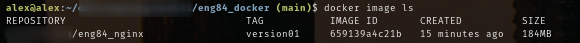

# Docker

## Docker hub account
We can create a docker hub account so that we can store our custom images on the cloud.

## Install

Then, we can check if docker is properly installed by checking its version
```sh
docker --version
```

## Building customised images, microservices

### Testing runtime
When we run a container, we specify the image of the container we want to run.
If the image is not in in the local repository on our host, it will pull it from docker hub, an online repository of docker images.

For example we can run a test container:
```
docker run hello-world
```
If this is the first time we ran this container, it will probably not be in our image list.
To check the current images, we can use:
```
docker images
# or
docker image ls
```
After the image is ran for the first time, we can find the original image on the above list.

### Pulling images
We can pull available images without running a container with them. To do this, we use the `pull` command.
> Note: To pull images, we don't require an account or login credentials, unless the image is private.

```
docker pull hello-world
```
### Docker processes
After running a lot of containers, we can check which of them are currently running:
```
docker ps 
```
We can also check for previously run containers by specifying the `-a` flag:
```
# List currently and previously run docker processes.
docker ps -a
```

### Shell inside the container
We can enter a container with  an interactive terminal
```
docker exec -ti <container-id> sh
```
### Execute commands
We can use the shell to perform the commands that we would like. However, we can also perform one time command from the host machine.
To do this, we can use the `exec` command:
```sh
docker exec -d <container-id> command
```
In the example, we removed the `index.html` file that is used as a landing page for NGINX.
```bash
docker exec -d nginx_container rm /usr/share/nginx/html/index.html
```

### Copying files between host and container
To copy a file between the host and the container, we can't use an `exec` command, as those are used to perform an action inside the container.
Instead, we use the `cp` subcommand that can copy a file from our host machine to the container:
```
docker cp index.html <container-id>:<destination-path>
```
In our case, we created a custom landing page, in `index.html` removed

> Note: To restart the nginx process inside the container we can use `nginx -s reload`

### Creating image from container

```bash
docker commit <container-id> <repository>/<image_name>:<tag>
```
After we perform the above command, we will be able to find the image in our image list.
In our example, we have created an image from the custom nginx container, with the updated landing page and named it `eng84_nginx`:


## Connecting to dockerhub
After creating an accound on [docker](hub.docker.com), we can login from the terminal to use docker cli:
```bash
docker login
```
